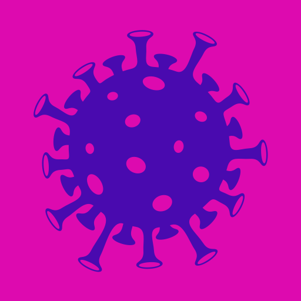

# Covid Today

Covid Today is an Android app based off of the web version here: https://codepen.io/tinacious/full/eYNbEoE

## Download

Download the [AppCenter](https://install.appcenter.ms/users/info-145/apps/covid-today/distribution_groups/everybody) build.

## Attributions and Credits

### API data

The source of the API data is from this open-source repository: https://github.com/disease-sh/API

### App icon illustration

<a href="https://www.vectorstock.com/royalty-free-vector/corona-virus-covid-19-2019-ncov-template-design-vector-30132318" target="_blank">Vector image by VectorStock / soponyono</a>

Modified by me.

### Icons

App icons are from [Material Design](https://material.io/resources/icons/?search=search&icon=search&style=baseline).

- Theme: rounded
- Size: 24dp
- Format: PNG
- Color: white
